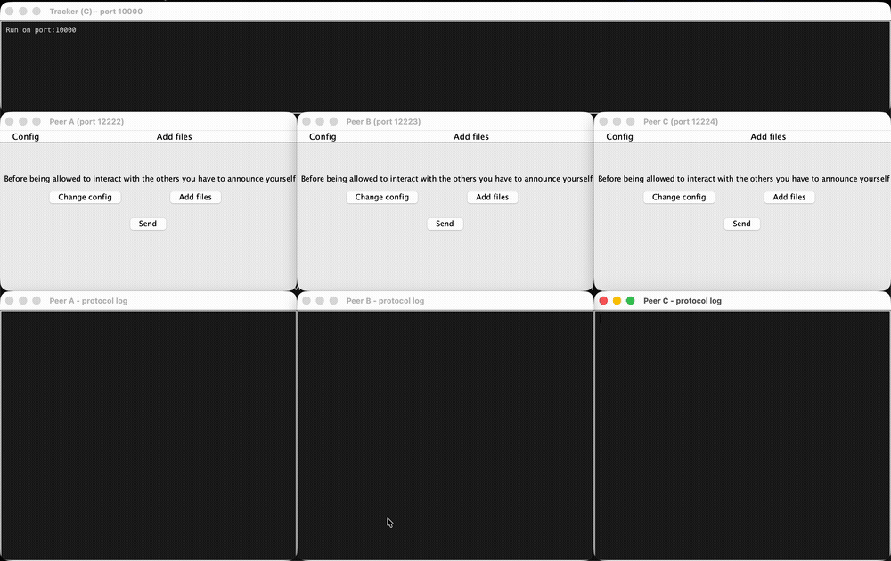

# sharefile-P2P

A **BitTorrent-like peer-to-peer file sharing** application: a **tracker written in C** keeps track of files and peers, and **peers written in Java** (with a Swing GUI) announce themselves, look for files and exchange them **piece by piece** directly with each other.

> By Johan Chataigner, Emeric Duchemin, Laurent Genty, Dylan Hertay and Lucas Trocherie. Full report (in French): [`rapport-p2p.pdf`](rapport-p2p.pdf).



*One tracker and three peers. Peer A shares `demo.txt` (10 KB, 11 pieces of 1 KB). Peers B and C look it up on the tracker, ask A for its buffermap, then fetch the pieces from A. Each peer's protocol log is shown under its window.*

## How it works

```
                 announce / look / getfile / update
   ┌──────────┐ ◄─────────────────────────────────► ┌──────────────┐
   │  Peer A  │                                     │ Tracker (C)  │
   │  (seed)  │                                     │ hash table + │
   └──────────┘                                     │ thread pool  │
        ▲  interested / have / getpieces / data     └──────────────┘
        │                                                  ▲
        ▼                                                  │
   ┌──────────┐ ◄──────────────────────────────────────────┘
   │  Peer B  │
   │ (leech)  │
   └──────────┘
```

1. **announce**: a peer registers with the tracker, giving its listening port and the files it seeds (`name size pieceSize md5`).
2. **look**: a peer searches the tracker by criteria (`filename="demo.txt"`, size…) and gets back the matching files and their keys (MD5).
3. **getfile**: the tracker answers with the list of peers (`ip:port`) holding that key.
4. **interested / have**: the downloader asks each peer for its **buffermap** (which pieces it has, Base64-encoded).
5. **getpieces / data**: the downloader requests the missing pieces and rebuilds the file once all of them have arrived; it then becomes a seeder.
6. **update**: every peer periodically tells the tracker what it seeds and leeches.

## Run the demo

Requirements: a C compiler with `make` (Linux or macOS) and a JDK (tested with Java 21).

```bash
demo/run-demo.sh
```

The script builds both parts, creates a working directory per peer under `demo/work/`, starts the tracker, then opens three peer windows and their logs. By default the GUIs are driven automatically (clicking the real buttons) so the run is reproducible; use `demo/run-demo.sh --manual` to click yourself. `Ctrl+C` stops everything.

On macOS, `demo/record.sh` records that run and writes `media/demo.mp4` and `media/demo.gif` (needs `ffmpeg` and the Screen Recording permission).

## Run it by hand

### Tracker (C)

```bash
cd tracker
make                 # N_THREADS=<n> make to change the thread pool size
make tests && build/tests
build/tracker 10000  # without a port, the one in config.ini is used
```

### Peer (Java)

```bash
cd peer
make
cd build && java gui
```

A peer reads `../config.ini` (tracker address and port, its own listening port), shares the files listed in `../seed.dat` and writes downloads to `../seed/`. To run several peers on one machine, give each one its own directory and `open-port`, as `demo/run-demo.sh` does.

In the GUI: **Add files** (path of a file to share) → **Send** to announce yourself → **Look for a file** → **Get file loading informations** with the file key to download it.

## Project structure

```
tracker/
  src/tracker.c        # socket server, protocol parsing (announce, look, getfile, update)
  src/hash_table.c     # files -> seeders / leechers
  src/port_table.c     # peer IP -> listening port
  src/thpool.c         # thread pool (third-party, MIT)
  tests/               # hash table and port table tests
peer/
  src/gui.java         # entry point (Swing GUI: guiRunner, loading)
  src/PeerConfig.java  # config.ini parsing, shared settings, logs
  src/*Tracker*.java   # tracker messages (announce, look, getfile, update)
  src/*Peer*.java      # peer messages (interested, have, getpieces) and the listening server
  src/FileManager.java # buffermaps, pieces, file reconstruction
demo/                  # demo launcher (window layout, autopilot, log viewer)
media/                 # demo GIF / video
```

## Known limitations

The code is kept as is, with only one fix to build on macOS (`_DARWIN_C_SOURCE` for `pthread_setname_np` in `thpool.c`). Known issues:

- A peer crashes when it serves a file that was already in its `seed/` folder at startup (buffermap size bug in `FileManager.getBuffermapToString`), so the demo shares the file from another folder.
- Pieces are sent as text, so only text files are transferred reliably.
- The tracker identifies peers by IP address, so several peers on the same machine share one entry in its port table.
